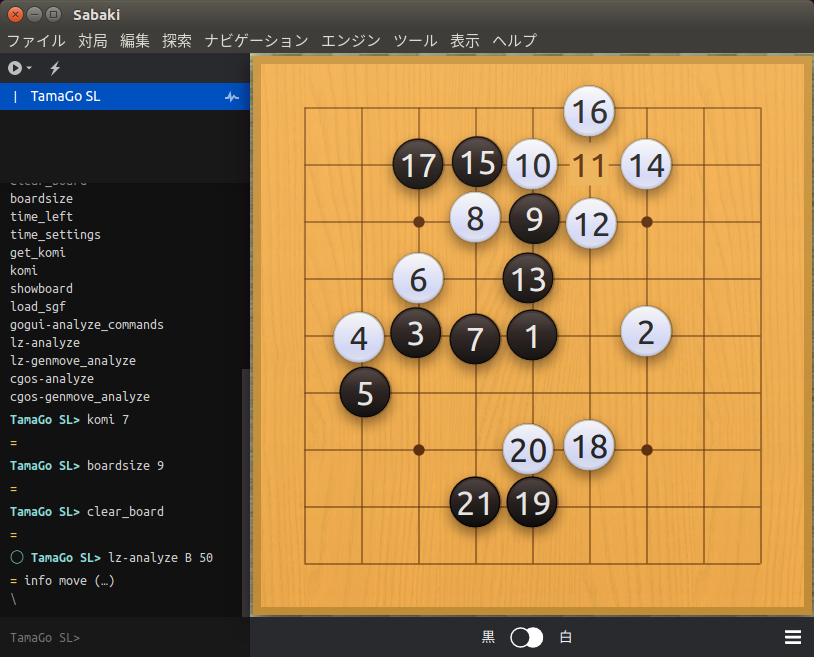
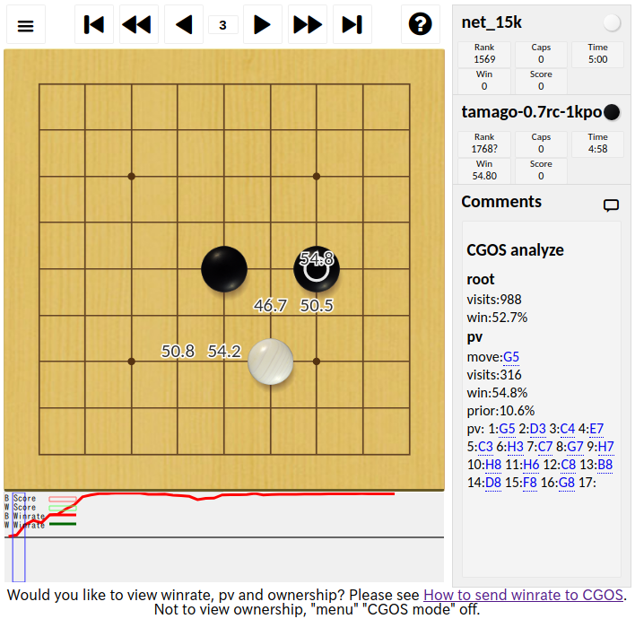
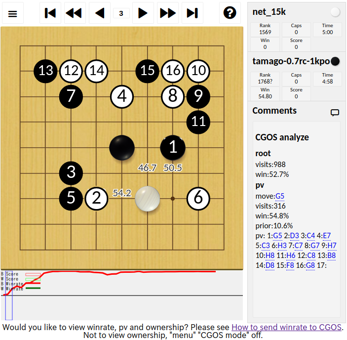

# TamaGo
TamaGo is a Go (Weiqi, Baduk) engine implemented in Python.
TamaGo has following features,
 - Supervised learning using SGF-format files.
 - Reinforcement learning with Gumbel AlphaZero method.
 - Move generation using Monte-Carlo tree search and a trained neural network model.

TamaGo runs on Python 3.6 or higher.

日本語は[こちら](doc/ja/README.md)をご覧ください。

中文文檔請看[這裡](doc/cn/README.md)。

- [TamaGo](#tamago)
- [Requirements](#requirements)
- [Installation](#installation)
- [How to execute GTP engine](#how-to-execute-gtp-engine)
  - [Examples of TamaGo execution as GTP engine.](#examples-of-tamago-execution-as-gtp-engine)
  - [Trained neural network parameters file.](#trained-neural-network-parameters-file)
- [How to execute supervised learning](#how-to-execute-supervised-learning)
- [How to execute reinforcement learning](#how-to-execute-reinforcement-learning)
- [GoGui analyze commands](#gogui-analyze-commands)
- [Analyze commands](#analyze-commands)
- [CGOS analyze mode](#cgos-analyze-mode)
- [License](#license)

# Requirements
| Package name | Purpose |
| --- | --- |
| click | Implementation of command line options |
| numpy | Fast calculation |
| pytorch | Implementation of neural network construction and learning |

# Installation
You can install TamaGo by executing the following command in a Python-installed computer.
```
pip install -r requirements.txt
```
You can use TamaGo with CPU only. It is recommended that you set up your computer so that you can use a GPU when executing neural network learning.

# How to execute GTP engine
When using a GUI that supports GTP (Go Text Protocol), the following command canb be used TamaGo as a engine,
```
python main.py
```

TamaGo's command line options are as follows,

| Option | Description | Value | Example of value | Default value | Note |
| --- | --- | --- | --- | --- | --- |
| `--size` | Size of go board | Integer number more than 1 and less than or equal to BOARD_SIZE | 9  | BOARD_SIZE | BOARD_SIZE is defined in board/constant.py.
| `--superko` | Activation super-ko rule | true or false | true | false | It supports only positional super-ko. |
| `--model` | Path to a trained neural network parameters file | String of model file path | model/model.bin| None |  It must be relative path from TamaGo's home directory |
| `--use-gpu` | Flag to use a GPU | true or false | true | false | |
| `--policy-move` | Flag to move according to Policy distribution | true or false | true | false | |
| `--sequential-halving` | Flag to use SHOT (Sequential Halving applied to trees) for searching | true or false | true | false | It's for debugging |
| `--visits` | The number of visits per move | Integer number more than 0 | 1000 | 1000 | When you use '--const-time' or '--time' options, this option is ignored. |
| `--const-time` | Time to thinking per move | Real number more than 0 | 10.0 | None | When you use '--const-time' or '--time' options, this option is ignored.|
| `--time` | Total remaining time for a game | Real number more than 0 | 600.0 | None |
| `--batch-size` | Mini-batch size for MCTS | Integer number more than 0 | 13 | NN_BATCH_SIZE | NN_BATCH_SIZE is defined in mcts/constant.py. |
| `--tree-size` | Maximum number of MCTS nodes | Integer number more than 0 | 100000 | MCTS_TREE_SIZE | MCTS_TREE_SIZE is defined in mcts/constant.py. |
| `--cgos-mode` | Enable to capture all dead stones. | true or false | true | false | |

## Examples of TamaGo execution as GTP engine.
1) Setting board size to 5, using model/model.bin as a trained file, avoiding to use a GPU.
```
python main.py --size 5 --model model/model.bin --use-gpu false
```
2) Activating super-ko rule.
```
python main.py --superko true
```
3) Using model/sl-model.bin as a trained file, generating moves with Policy distribution.
```
python main.py --model model/sl-model.bin --policy-move true
```
4) Setting total remaining time to 10 minites.
```
python main.py --time 600
```
5) Setting the number of visits per move to 500.
```
python main.py --visits 500
```
6) Setting time to thinking time per move to 10 seconds.
```
python main.py --const-time 10.0
```
7) Settings for testing on CGOS.
```
python main.py --model model/sl-model.bin --use-gpu true --cgos-mode true --superko true --batch-size 13 --time 600 --komi 7 --tree-size 200000
```


## Trained neural network parameters file.
Trained neural network parameters file is available [here](https://github.com/kobanium/TamaGo/releases). When you place a trained file in the "model" direcotry under the name "model.bin", you can run TamaGo using a trained file without a command line option. If TamaGo's structure of neural network and a trained neural network parameter files are unmached, TamaGo cannot load a trained file. Please care about version of the trained model file and version of TamaGo.
On TamaGo 0.6.3 is pretty stronger than GNUGo level 10 (about +420 elo). Using Monte Carlo tree search, TamaGo 0.6.3 (100 visits/move) with sl-model.bin is stronger than Ray ver 9.0 10k playouts/move (about +180 elo).  
TamaGo has changed it's neural network structure from version 0.6.0, You cannot use trained model files for older version.

# How to execute supervised learning
For more information on how to execute supervised learning, please check [here](doc/en/supervised_learning.md).

# How to execute reinforcement learning
For more information on how to execute reinforcement learning, please check [here](doc/en/reinforcement_learning.md).

# GoGui analyze commands
When you use [GoGui](https://sourceforge.net/projects/gogui/), you can check Policy values for current position, and color according to Policy values.  
Value range of Policy is more than or equal 0.0 and less than or equal to 1.0.


Redder is higher value, bluer is lower value.


# Analyze commands
TamaGo version 0.7.0 supports lz-analyze and lz-genmove_analyze commands. When you use Lizzie or Sabaki, you can analyze positions using these commands.


# CGOS analyze mode
TamaGo version 0.7.0 supports cgos-analyze, cgos-genmove_analyze commands. When you connect [Computer Go Server (CGOS)](http://www.yss-aya.com/cgos/) for testing TamaGo, you can check search information enabling --cgos-mode option.





# License
You can use TamaGo under [Apache License 2.0](LICENSE).
