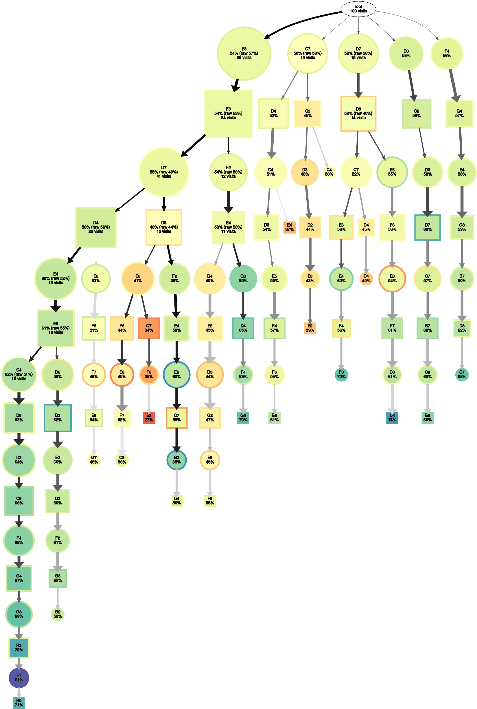

# About tree visualization
TamaGo supports visualization of a search treem.

## Example
```
(echo 'tamago-readsgf (;SZ[9]KM[7];B[fe];W[de];B[ec])';
 echo 'lz-genmove_analyze 7777777';
 echo 'undo';
 echo 'tamago-dump_tree') \
| python3 main.py --model model/model.bin --strict-visits 100 \
| grep dump_version | gzip > tree.json.gz
python3 graph/plot_tree.py tree.json.gz tree_graph
display tree_graph.svg
```



## Command line arguments for graph/plot_tree.py

| Argument | Description | Value | Example of value | Node |
|---|---|---|---|---|
| INPUT_JSON_PATH | Path to a .json file which has a result of tamago-dump_tree command. | tree.json.gz | |
| OUTPUT_IMAGE_PATH | Path to a image file which has a visualization result. | tree_graph | | Automatically assigned extension(.svg) |

## Option for graph/plot_tree.py

| Option | Description | Value | Example of value | Default value | Node |
|---|---|---|---|---|---|
| `--around-pv` | Flag to include all tree nodes. | true or false | true | false | |
